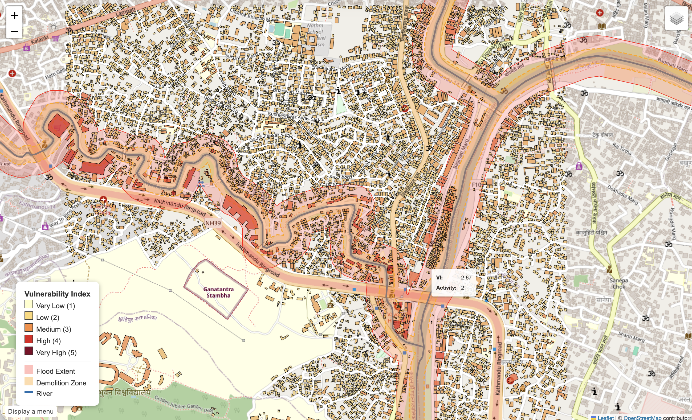

# kathmandu-flood-index-
### Spatial Flood Vulnerability Index for Kathmandu (Balkhu / Bishnumati Corridor)
*An empirical extension and data-scarce adaptation of the Xia et al. (2022) framework*

---

## 📌 Project Overview
Following the devastating September 2024 floods in Kathmandu, Nepal, this project develops an end-to-end spatial analytics pipeline that calculates a building-level **Flood Vulnerability Index (FVI)** along the flood-prone Bishnumati River corridor (Balkhu/Kalanki area). 

The methodology adapts the three-factor vulnerability framework proposed by **Xia et al. (2022)** to a real-world, data-scarce urban environment:
1. **Activity Criticality**: Building usage and community function (OSM `amenity` & `building` tags).
2. **Building Environment**: Physical proximity to the active river channel (Euclidean distance computed in metric UTM Zone 45N).
3. **Occupant Demographics**: Occupancy proxies derived from building footprint geometry and Census 2021 ward-level population density.

The pipeline also simulates the spatial impacts of the Kathmandu local government's proposed **30-metre riverbank clearance / demolition zone**, assessing flood exposure pre- vs. post-demolition.

---

## 📊 Results & Impact Assessment



### Key Quantitative Findings (Balkhu/Kalanki Study Area: 9,907 Buildings)
The pipeline analyzed **9,907 verified building footprints** and evaluated exposure against the September 2024 flood inundation zone (using an 80 m river-corridor proxy validated against satellite SAR limits):

| Metric | Pre-Demolition Baseline | Post-Demolition (30m River Buffer) | Impact / Delta |
| :--- | :--- | :--- | :--- |
| **Total Buildings In Study Area** | 9,907 | 9,457 | -450 buildings relocated |
| **Buildings Flooded (Exposed)** | **1,914** | **1,464** | **-450 buildings** |
| **Exposure Percentage** | **19.32%** | **15.48%** | **-23.51% relative reduction** |
| **Structures Removed in Demolition Zone** | — | **450** | 100% within 30m river zone |
| **Average Vulnerability Score of Demolished Buildings** | **4.21 / 5.00** | — | High to Very High Risk |

### Spatial Distribution & Critical Infrastructure Observations
- **Critical Infrastructure (Tier 5)**: 17 critical facilities (hospitals, clinics, emergency responders) were identified in the area. 4 healthcare facilities located within 100 m of the river scored between 4.00 and 4.67 on the composite index, highlighting high emergency response vulnerability.
- **Demolition Trade-offs**: While clearing the 30-metre riverbank eliminates 450 of the most vulnerable buildings (reducing flood-exposed structures by **23.5%**), **1,464 buildings still remain exposed** to severe inundation in the 30–80 m zone, proving that riverbank demolition alone is insufficient without upstream catchment management and secondary flood barriers.
- **Informal Settlements & Dense Residential Fabric**: Over 97% of structures in the corridor are residential or mixed-use with high occupant density, clustered in low-elevation meanders of the Bishnumati.

---

## ⚙️ What's Being Done in the Process

The automated pipeline (`index_pipeline.py`) executes seven key spatial processing stages:

```
[OpenStreetMap API]       [CBS 2021 Census]         [UNOSAT SAR / River Data]
        │                         │                           │
        ▼                         ▼                           ▼
1. Extract & Sanitize      2. Spatial Join             3. Buffer Analysis
   Building Footprints        Demographic Proxies         (30m Demo vs 80m Flood)
        │                         │                           │
        └─────────────────────────┼───────────────────────────┘
                                  ▼
                    4. Calculate Index Factors
                       ├─ Activity Criticality (1–5)
                       ├─ Building Environment (1–5)
                       └─ Occupant Demographics (1–5)
                                  │
                                  ▼
                    5. Composite Index (Xia et al. Eq. 1)
                       VI = (Activity + Environment + Demographics) / 3
                                  │
                                  ▼
                    6. Impact Assessment (Pre vs. Post)
                                  │
                                  ▼
                    7. High-Performance Folium / Leaflet Map
                       (Optimized FeatureCollection + HTML Legend)
```

### 1. Data Ingestion & Geometric Cleaning
- Footprints and waterways are queried via `osmnx` and the Overpass API for bounding box coordinates `[27.675°N, 85.285°E, 27.695°N, 85.305°E]`.
- Polygons are validated and sanitized: non-polygon artifacts (points, single nodes) are filtered out, leaving 9,907 clean building footprints.

### 2. Activity Criticality Scoring (1–5 Scale)
Addresses tag sparsity in developing world OSM datasets by cross-checking both `amenity` and `building` tags:
- **Tier 5 (Critical Infrastructure)**: Hospitals, clinics, emergency services, pharmacies, healthcare.
- **Tier 4 (Educational / Public Gatherings)**: Schools, colleges, universities, libraries.
- **Tier 3 (Commercial / Civic)**: Retail, markets, banks, offices, places of worship.
- **Tier 2 (Residential Default)**: Residential dwellings, houses, apartments (covers ~97% of urban fabric).
- **Tier 1 (Ancillary)**: Sheds, outbuildings, structures without building/amenity classifications.

### 3. Metric Spatial Transformation & Euclidean Distance
- Both building footprints and waterways are reprojected from WGS84 (`EPSG:4326`) into Universal Transverse Mercator **UTM Zone 45N (`EPSG:32645`)**.
- Minimum Euclidean distance to the river centerline is calculated for each polygon:
  - `< 10 m`: Score 5
  - `10–20 m`: Score 4
  - `20–50 m`: Score 3
  - `50–100 m`: Score 2
  - `> 100 m`: Score 1

### 4. Occupant Demographics Integration
- Building footprint area ($m^2$) is computed directly from UTM geometries.
- A spatial join intersects building centroids with ward sectors (CBS Nepal 2021 population densities: Nagarjun/Chandragiri corridor, 15,000–22,000 people/$km^2$).
- Area thresholds modulate the baseline score, giving higher exposure weight to larger multi-family complexes and critical facilities.

### 5. Composite Vulnerability Index Calculation
Following Xia et al. (2022) Equation 1, the three components are combined with equal weighting:
$$\text{Vulnerability Index} = \frac{\text{Activity Score} + \text{Environment Score} + \text{Demographics Score}}{3.0}$$

### 6. Demolition & Exposure Simulation
- A **30 m buffer** along the river centerline models the proposed demolition zone.
- An **80 m buffer** models the September 2024 severe flood inundation footprint.
- Spatial intersection identifies structures removed, baseline flooded structures, and post-demolition residual exposure.

### 7. Optimized Interactive Map Generation
- Avoids Leaflet DOM bloat: instead of generating 9,907 separate Leaflet layers (which produces unrenderable 21MB+ files), features are structured into a streamlined single `folium.GeoJson` `FeatureCollection` (5.8MB).
- Includes dynamic tooltip hover, attribute popup modals (scores, ward ID, area, flood status), and an embedded custom CSS color ramp legend.

---

## 🗂️ Repository Structure

```
├── README.md                      # Comprehensive documentation & methodology
├── results.png                    # High-resolution visualization of final vulnerability map
├── .gitignore                     # Git tracking exclusions
├── misc/                          # Development notes & planning artifacts (git-ignored)
├── index_pipeline.py              # Primary end-to-end vulnerability & mapping pipeline
├── pipeline.py                    # Data fetch script for OSM and UNOSAT shapefiles
├── mock_data.py                   # Synthetic data fallback generator for testing
├── get_real_river.py              # River geometry fetch utility
├── data/
│   ├── buildings.geojson          # Cleaned OSM building footprints (9,907 features)
│   └── waterways.geojson          # OSM river geometry for Bishnumati corridor
└── output/
    └── vulnerability_map.html     # Interactive Leaflet/Folium web map
```

---

## 🚀 Quickstart & Reproduction

### 1. Clone & Environment Setup
```bash
git clone https://github.com/Sangameeee/kathmandu-flood-index-.git
cd kathmandu-flood-index-

# Create Python virtual environment
python3 -m venv venv
source venv/bin/activate    # On Windows: venv\Scripts\activate

# Install required geospatial packages
pip install geopandas osmnx folium pandas requests shapely matplotlib mapclassify
```

### 2. Run Pipeline
```bash
# Execute the vulnerability analysis and generate the interactive map
python index_pipeline.py
```

### 3. View the Interactive Map
```bash
# macOS
open output/vulnerability_map.html

# Linux
xdg-open output/vulnerability_map.html

# Windows
start output/vulnerability_map.html
```

---

## 🔬 Limitations & Future Work

1. **UNOSAT Satellite Extent Coverage**: UNOSAT SAR flood extent shapefiles (`FL20240928NPL`) stopped at longitude 85.0°E, narrowly missing the Kathmandu valley core (85.29°E). Future iterations will ingest high-resolution Sentinel-1 SAR GRD imagery processed via Google Earth Engine or Copernicus CEMS.
2. **Topographic Elevation (HAND Model)**: The current environment score utilizes 2D Euclidean distance. Coupling this with TanDEM-X 12m or ALOS AW3D30 digital elevation models (DEM) to compute **Height Above Nearest Drainage (HAND)** would account for natural levees and micro-topography.
3. **Hydrodynamic Depth Simulation**: Implementing 2D hydraulic flood modeling (HEC-RAS or LISFLOOD-FP) would replace binary inundation buffers with continuous flood depth and velocity fields, enabling structural stage-damage curves.

---

## 📖 References
- **Xia, J. et al. (2022)**. *A framework for spatial flood vulnerability index computation*.
- **UNOSAT / UNITAR (2024)**. *Nepal Floods September 2024 — Satellite-derived Flood Assessment*.
- **Central Bureau of Statistics (CBS), Nepal (2021)**. *National Population and Housing Census 2021*.
- **OpenStreetMap contributors (2024)**. *Planet dump retrieved via Overpass API*.
